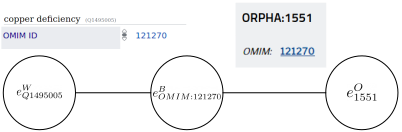

# Multilingual ontology from Wikidata

This package is linked to the paper [Multilingual enrichment of disease biomedical ontologies](https://hal.archives-ouvertes.fr/hal-02531140v1) to appear at the 2nd workshop on MultilingualBIO: Multilingual Biomedical Text Processing.

Wikidata is an open-source knowledge base that contains entities (ex: [Q2013](https://www.wikidata.org/wiki/Q2013), the Wikidata entity).
For each entity wikidata provides labels in different languages and a list of various properties. 
Among these properties, some identify the entity in external data sources, for example ontologies ([P699](https://www.wikidata.org/wiki/Property:P699) which is a property referring to the [Disease Ontology](https://disease-ontology.org/)) or databases ([P628](https://www.wikidata.org/wiki/Property:P628) referring to the [approved food additives in Europe](https://webgate.ec.europa.eu/foods_system/main/?sector=FAD&auth=SANCAS)).

When working with such external sources, one can face issues regarding the monolingualism or the unavailability in some languages. 
The idea here is to use the multilinguality of Wikidata via the labels, to extract translations of the external sources entity from Wikidata.
The method can be also used to extract synonyms of the entities in some languages.

This package offers multiple approaches to do extraction:

**WARNING**: This package might lead to a 24 hours IP ban from the SPARQL server of WikiData if used extensively.


## Setup the User-Agent

The first step to use this package is to set up a user-agent corresponding to the [Wikimedia rules of User-Agent](https://meta.wikimedia.org/wiki/User-Agent_policy).

This is done with the following commands.

```python
from wikidata_property_extraction import header

header.initialize_user_agent('Example User Agent')
```

Please follow the rules stated in the link above to choose your user-agent.

## First order Wikidata Extraction
### Full ontology extraction

The easiest way is to extract all the entities in WikiData which are linked to a specific property. For example, if I want to extract all the labels and alternative labels from the entities of Orphanet in Spanish, the command will be:

```python
from wikidata_property_extraction import translation
translate = translation.Translator('P1550', ['es'])
result_df = translate.translate()
```

`result_df` is a Pandas DataFrame with the columns: ['entity', 'value_property', 'labelEs', 'altEs'], where
'entity' is the ID of the entity in WikiData, 'value_property' is the ID of the entity in Orphanet, 'labelEs' is
respectively the main label in Spanish, and 'altEs' is the alternative labels separated by a '|' 
of the entity in Spanish. 'labelEs' can also have labels separated by '|' in the case where the ID of the external source is linked to more than one element in Wikidata.

Thus, result_df won't have the same number of rows than the number of entities in WikiData with the property as there are only
the entities which have at least one label in one of the requested languages.

Example of first line  of the resulting DataFrame:

|   | entity                               | value_property | labelEs | altEs                                    |
|---|--------------------------------------|----------------|---------|------------------------------------------|
| 0 | https://www.wikidata.org/wiki/Q51993 | 319218         | ébola   | fiebre hemorrágica del Ébola\|EVE\|[...] |


### Extraction on list of IDs

As sometimes there is no need to translate all the entities of the ontologies, there is also a function that takes as input
a list of IDs, a property and a list of languages. The query will only be on the requested IDs. It will be faster
for big ontologies.

The command is:

```python
from wikidata_property_extraction import translation
translate = translation.Translator('P2586', ['pl', 'fr'])
result_df = translate.translate(id_list=['01', '02', '03', '04'])
```

This request queries the information of the French Departments with IDs 01, 02, 03 and 04. 
result_df is a Pandas DataFrame with the columns: ['entity', 'value_property', 'labelPl', 'altPl', 'labelFr', 'altFr']

|   | entity                               | value_property | labelPl | altPl | labelFr | altFr                    |
|---|--------------------------------------|----------------|---------|-------|---------|--------------------------|
| 0 | http://www.wikidata.org/entity/Q3083 | 01             | Ain     |       | Ain     | 01\|département de l'Ain | 

## Second order extraction

Another feature is the possibility to extract elements considering second order relations. In other words, going through
intermediate ontologies to extend even more the elements that are extracting from WikiData.

Example:



In this example, we want to extend the entity <em>1551</em> of Orphanet. However, this entity is linked to nothing in WikiData.
But it is linked to entity <em>121270</em> of OMIM, and this entity is linked to the entity <em>Q1495005</em> of WikiData.

In the module second_order, a class SecondOrder can do this. It takes as input:
- main_property_id: the main property id in WikiData, a DataFrame with
- links_df; the links between the main ontology and the external ones, this DataFrame takes three columns with the
following names:
    - value_property: the value of the main property (in the example: 1551)
    - id_auxiliary: the value of the external property (in the example: 121270)
    - name_auxiliary: the name of the external ontology (in the example: OMIM)
- dict_properties: the dictionary of the properties, in the format 'WikiData_property': 'external_ontology_name'. Example: {'P492': 'OMIM'}
- languages_list: the list of the languages, with the code [here](https://www.wikidata.org/wiki/Help:Wikimedia_language_codes/lists/all), 
for example ['cs', 'pl'] for Czech and Polish.
- limit: the limit of elements in one query
- all_elem: a flag to say if the translation is on the entire main property or only the elements which are in links_df.
- url: the url of the sparql endpoint of WikiData

In the code:

```python
import pandas as pd

from wikidata_property_extraction import second_order

links_df = pd.DataFrame([['1551', '121270', 'OMIM']], columns=['value_property', 'id_auxiliary', 'name_auxiliary']) # Here the name of the columns have no importance, only the order have one.
dict_properties = {'P492': 'OMIM'}

translator = second_order.SecondOrder('P699', links_df, dict_properties, ['cs', 'fr'], all_elem=False)
results_df = translator.translate()
```

The results_df dataframe is:

|   | entity                                  | value_property | labelCs  | altCS | labelFr           | altFr | id_auxiliary | name_auxiliary | source_degree |
|---|-----------------------------------------|----------------|----------|-------|-------------------|-------|-------------|----------------|---------------|
| 0 | http://www.wikidata.org/entity/Q1495005 | 1551           | Q1495005 |       | carence en cuivre |       | 121270       | OMIM           | Second        |

The labelCs is the id of the WikiData entity as this entity as no translation in Czech for this entity.

## Citation

If you use this package please cite this paper:

```bibtex
@inproceedings{bouscarrat:hal-02531140,
  TITLE = {{Multilingual enrichment of disease biomedical ontologies}},
  AUTHOR = {Bouscarrat, L{\'e}o and Bonnefoy, Antoine and Capponi, C{\'e}cile and Ramisch, Carlos},
  URL = {https://hal.archives-ouvertes.fr/hal-02531140},
  BOOKTITLE = {{2nd workshop on MultilingualBIO: Multilingual Biomedical Text Processing}},
  ADDRESS = {Marseille, France},
  YEAR = {2020},
  MONTH = May,
  KEYWORDS = {wikidata ; ontology ; translation ; biomedical},
  PDF = {https://hal.archives-ouvertes.fr/hal-02531140/file/enrichment_ontology%20%281%29.pdf},
  HAL_ID = {hal-02531140},
  HAL_VERSION = {v1},
}

```